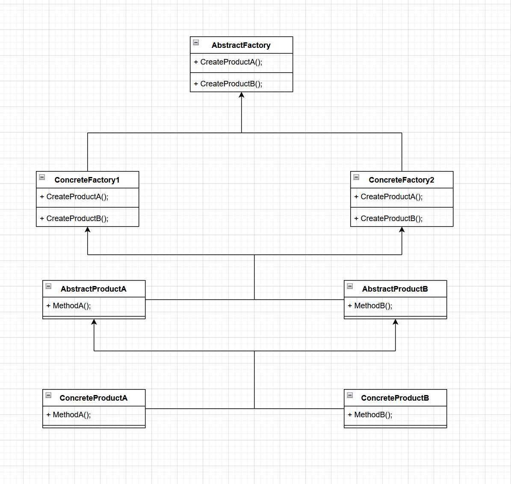

# Abstract Factory
### Introducción
La Abstract Factory (Fábrica Abstracta) es un patrón de diseño creacional que resuelve el problema de crear familias de objetos relacionados sin especificar sus clases concretas. Proporciona una interfaz para crear objetos de varias clases relacionadas, pero deja la creación de objetos concretos a las clases derivadas (fábricas concretas)
 ### Problema resuelto
El patrón Abstract Factory resuelve el problema de crear familias de objetos relacionados de manera coherente y sin acoplar el código a las clases concretas. Permite crear objetos relacionados sin tener que especificar las clases concretas exactas, lo que facilita la flexibilidad y el intercambio de familias de objetos.
### Implementación
La implementación del patrón Abstract Factory implica la creación de una interfaz abstracta llamada "AbstractFactory" que declara los métodos para crear los diferentes tipos de objetos relacionados. Luego, se implementan las "fábricas concretas" que extienden la interfaz AbstractFactory y proporcionan la implementación específica para crear los objetos concretos de una familia.
### Diagrama de clases

### Ejemplo funcional
Supongamos que estamos desarrollando un juego de rol y queremos implementar la creación de diferentes tipos de personajes, como guerreros y magos, para dos facciones: humanos y elfos. Utilizaremos el patrón Abstract Factory para crear familias de objetos relacionados sin especificar las clases concretas.

```
//AbstractFactory
public interface CharacterFactory {
    Warrior createWarrior();
    Mage createMage();
}

    //ConcreteFactory1
public class HumanFactory implements CharacterFactory {
    @Override
    public Warrior createWarrior() {
        return new HumanWarrior();
    }

    @Override
    public Mage createMage() {
        return new HumanMage();
    }
}

// ConcreteFactory2
public class ElfFactory implements CharacterFactory {
    @Override
    public Warrior createWarrior() {
        return new ElfWarrior();
    }

    @Override
    public Mage createMage() {
        return new ElfMage();
    }
}

// AbstractProductA
public interface Warrior {
    void attack();
}

// ConcreteProductA1
public class HumanWarrior implements Warrior {
    @Override
    public void attack() {
        System.out.println("Human warrior attacks!");
    }
}

// ConcreteProductA2
public class ElfWarrior implements Warrior {
    @Override
    public void attack() {
        System.out.println("Elf warrior attacks!");
    }
}

// AbstractProductB
public interface Mage {
    void castSpell();
}

// ConcreteProductB1
public class HumanMage implements Mage {
    @Override
    public void castSpell() {
        System.out.println("Human mage casts a spell!");
    }
}

// ConcreteProductB2
public class ElfMage implements Mage {
    @Override
    public void castSpell() {
        System.out.println("Elf mage casts a spell!");
    }
}

// Client
public class Game {
    private CharacterFactory characterFactory;

    public Game(CharacterFactory characterFactory) {
        this.characterFactory = characterFactory;
    }

    public void createCharacters() {
        Warrior warrior = characterFactory.createWarrior();
        Mage mage = characterFactory.createMage();

        warrior.attack();
        mage.castSpell();
    }

    public static void main(String[] args) {
        Game game = new Game(new HumanFactory());
        game.createCharacters();

        // Output:
        // Human warrior attacks!
        // Human mage casts a spell!
    }
}
```

En este ejemplo, creamos una interfaz CharacterFactory que define los métodos para crear guerreros y magos. Luego, implementamos dos fábricas concretas HumanFactory y ElfFactory, que proporcionan la implementación específica para crear personajes humanos y elfos respectivamente.

También tenemos las interfaces Warrior y Mage, junto con sus implementaciones concretas para los personajes humanos y elfos.

En el cliente (Game), creamos una instancia de la fábrica concreta deseada (por ejemplo, HumanFactory) y utilizamos los métodos de la interfaz CharacterFactory para crear un guerrero y un mago. Luego, llamamos a los métodos específicos de los personajes (por ejemplo, attack() y castSpell()).
### Ventajas
- Proporciona una forma de crear familias de objetos relacionados sin acoplar el código a las clases concretas.
- Permite el intercambio fácil de familias de objetos, ya que solo se necesita cambiar la fábrica concreta utilizada.
### Desventajas
- A medida que se agregan nuevas familias de objetos, puede resultar complejo extender las fábricas abstractas y las fábricas concretas.
- Puede resultar innecesariamente complejo si solo hay una única familia de objetos en el sistema. En ese caso, puede ser más conveniente utilizar el patrón Factory Method.
