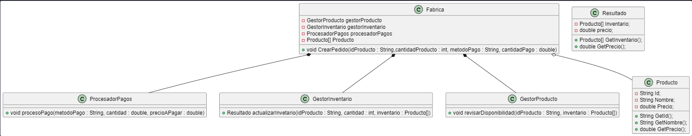

# Fachada

El patron Fachada o _Facade_ en Ingles, es un patrón de diseño estructura por lo que define como esta estructurado el programa. Más en concreto, resuelve es la complejidad de las llamadas a metodos, debido a que como el nombre dice, solo tiene una _fachada._ El patron se implementa a traves de una clase con un solo metodo y de atributos como clases queramos que se accedan, al que el usuario solo accederá al metodo. Este metodo implicitamente realizara las llamadas debidas y gestionara los datos pertinentes. El usuario solo debe llamar a ese metodo y enviarle los parametros correspondientes, luego el metodo se encargara del resto.



Este es el diagrama de clases del ejemplo de la __Fabrica__ propuesto para el uso del patrón _Facade_

## Ventajas y Desventajas

| Ventajas ✔                                                        | Desventajas ❌                                                                                                   |
| ----------------------------------------------------------------- | ---------------------------------------------------------------------------------------------------------------- |
| Puedes aislarel codigo de la <br />complejidad de los subsistemas | Una fachada puede convertirse <br />en un objeto todopoderoso<br /> acoplado a todas las clases de la aplicacion |
| El usuario tiene mayor facilidad para<br />hacer uso del programa |                                                                                      

## Ejemplo

Para mostrar el funcionamiento de este patron, hemos realizado una clase llamada _Fabrica_ que tendra un solo metodo llamado _CrearPedido_ al que accedera el cliente con todos los parametros necesarios para realizar el pedido. Este metodo llamara a los metodos y clases necesarios para realizar su función.
````java
public class Fabrica {
    private GestorProducto gestorProducto;
    private GestorInventario gestorInventario;
    private ProcesadorPagos procesadorPagos;
    private Producto[] Inventario;
    public Fabrica(){
        this.gestorProducto = new GestorProducto();
        this.gestorInventario = new GestorInventario();
        this.procesadorPagos = new ProcesadorPagos();
        this.Inventario = new Producto[]{
            new Producto("abc", "patatas fritas", 10.0),
            new Producto("abc", "patatas fritas", 10.0),
            new Producto("abd", "patatas fritas", 10.0)
        };
    }
    public void CrearPedido(String idProducto, int cantidadProducto, String metodoPago, double cantidadPago) throws Exception{
        gestorProducto.revisarDisponibilidad(idProducto, this.Inventario);
        Resultado salida;
        salida = gestorInventario.actualizarInventario(idProducto, cantidadProducto, this.Inventario);
        procesadorPagos.procesoPago(metodoPago, cantidadPago, salida.GetPrecio());
    }
}
````

El _GestorProducto_ será el encargado de revisar la disponibilidad del producto deseado a traves del metodo _RevisarDisponibilidad_.

````java
public class GestorProducto {
    public void revisarDisponibilidad(String idProducto, Producto[] inventario) throws Exception{
        System.out.println("Verificando disponibilidad del producto " + idProducto);
        // Logica para verificar disponibilidad del producto
        for (Producto producto : inventario)
            if(producto.GetId() == idProducto)
                return;
        throw new Exception("El producto no esta disponible");
    }
}
````

La clase _GestorInventario_ actualizara el inventario en base a si se encuentra o no el producto en el Array de _Producto_ en _Inventario_.

````java
public class GestorInventario {
    public Resultado actualizarInventario(String idProducto, int cantidad, Producto[] inventario) throws Exception{
        System.out.println("Actualizando inventario para el producto " + idProducto + ", cantidad: " + cantidad);
        // Logica para actualizar el inventario
        int cantidadExistente = 0;
        for(Producto producto: inventario)
            if(producto.GetId() == idProducto)
                cantidadExistente++;
       
        if(cantidadExistente < cantidad)
            throw new Exception("No se tiene la cantidad suficiente del producto");
        Producto[] nuevoInventario = new Producto[inventario.length - cantidad];
        int cantidadRestante = cantidadExistente - cantidad;
        int pos = 0;
        double precio = 0;
        for(Producto producto: inventario){
            if(producto.GetId() == idProducto && cantidadRestante <= cantidadExistente){
                cantidadExistente--;
            }else{
                nuevoInventario[pos] = producto;
                precio = producto.GetPrecio();
                pos++;
            }
        }
        return new Resultado(nuevoInventario, precio * cantidad );
    }
}
````

La clase _ProcesadorPago_ es la encargada de cobrarle al cliente por el pedido y devolver el resto en caso de que lo haya

````java
public class ProcesadorPagos {
    public void procesoPago(String metodoPago, double cantidad, double precioAPagar) throws Exception{
        System.out.println("Procesando pago de " + cantidad + " a traves de " + metodoPago);
        if(cantidad < precioAPagar)
            throw new Exception("No se dispone del dinero suficiente para pagar");
        System.out.println("El pago se ha realizado con exito. " + (metodoPago == "Efectivo" ? "Se devuelven " + (cantidad-precioAPagar) + " euros" : ""));
    }
}
````

Las clases de apoyo como _Producto_, _Resultado_ y el archivo principal del programa _Main_.

### Producto
````java
public class Producto {
    public String Id;
    private String Nombre;
    private double Precio;
    public Producto(String Id, String Nombre, double Precio){
        this.Id = Id;
        this.Nombre = Nombre;
        this.Precio = Precio;
    }
    public String GetId(){
        return this.Id;
    }
    public String GetNombre(){
        return this.Nombre;
    }
    public double GetPrecio(){
        return this.Precio;
    }
}
````

### Resultado

````java
public class Resultado {
    private Producto[] Inventario;
    private double precio;
    public Resultado(Producto[] Inventario, double precio){
        this.Inventario = Inventario;
        this.precio = precio;
    }
    public Producto[] GetInventario(){
        return this.Inventario;
    }
    public double GetPrecio(){
        return this.precio;
    }
}
````

### Main

````java
public class Fachada {

    /**
     * @param args the command line arguments
     */
    public static void main(String[] args) throws Exception {
        Fabrica gestionarOrdenes = new Fabrica();
        gestionarOrdenes.CrearPedido("abc", 2, "Efectivo", 25.0);
    }
    
}

````

## Webgrafia

- [Refactoring guru](https://refactoring.guru/es/design-patterns/facade "refactoring.guru")
- [The PowerUps Learning](https://thepowerups-learning.com/patrones-de-diseno-facade/ "thepowerups-learning.com")
- [Junta de Andalucia](https://www.juntadeandalucia.es/servicios/madeja/contenido/recurso/189 "juntadeandalucia.es")
- [Reactive Programming](https://reactiveprogramming.io/blog/es/patrones-de-diseno/facade "reactiveprogramming.io")
