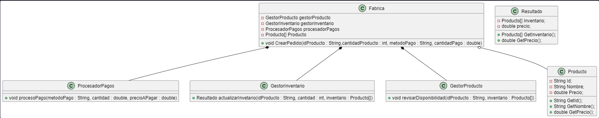
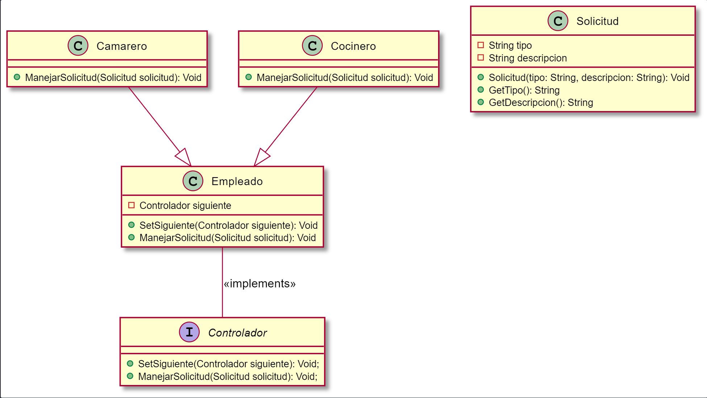
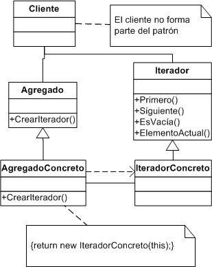
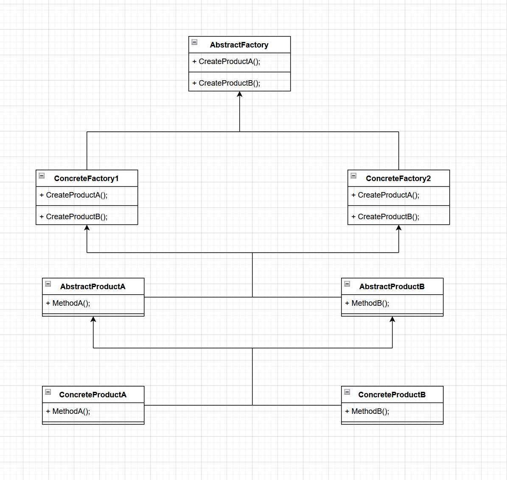

# Trabajo Patrones de Diseño

Grupo compuesto por:
* Héctor Rodríguez
* David Esquivas
* Jesus Manuel Liñan

Patrones realizados:
1. [Facade](#fachada)
2. [Chain Of Responsability](#chain-of-responsability)
3. [Iterator](#iterator)
4. [Abstract Factory](#abstract-factory)

# Fachada

El patron Fachada o _Facade_ en Ingles, es un patrón de diseño estructura por lo que define como esta estructurado el programa. Más en concreto, resuelve es la complejidad de las llamadas a metodos, debido a que como el nombre dice, solo tiene una _fachada._ El patron se implementa a traves de una clase con un solo metodo y de atributos como clases queramos que se accedan, al que el usuario solo accederá al metodo. Este metodo implicitamente realizara las llamadas debidas y gestionara los datos pertinentes. El usuario solo debe llamar a ese metodo y enviarle los parametros correspondientes, luego el metodo se encargara del resto.



Este es el diagrama de clases del ejemplo de la __Fabrica__ propuesto para el uso del patrón _Facade_

## Implementación

Para la implementación de este patrón necesitamos una clase que se encargue de gestionar con un solo metodo toda la solicitud, llamando y ejecutando los metodos correspondientes. En el ejemplo propuesto, esta clase será __Fabrica__ que a traves del metodo __CrearPedido__ gestionara la solicitud del usuario para realizar un pedido.

## Ventajas y Desventajas

| Ventajas ✔                                                        | Desventajas ❌                                                                                                   |
| ----------------------------------------------------------------- | ---------------------------------------------------------------------------------------------------------------- |
| Puedes aislarel codigo de la <br />complejidad de los subsistemas | Una fachada puede convertirse <br />en un objeto todopoderoso<br /> acoplado a todas las clases de la aplicacion |
| El usuario tiene mayor facilidad para<br />hacer uso del programa |                                                                                      

## Ejemplo

Para mostrar el funcionamiento de este patron, hemos realizado una clase llamada _Fabrica_ que tendra un solo metodo llamado _CrearPedido_ al que accedera el cliente con todos los parametros necesarios para realizar el pedido. Este metodo llamara a los metodos y clases necesarios para realizar su función.
````java
public class Fabrica {
    private GestorProducto gestorProducto;
    private GestorInventario gestorInventario;
    private ProcesadorPagos procesadorPagos;
    private Producto[] Inventario;
    public Fabrica(){
        this.gestorProducto = new GestorProducto();
        this.gestorInventario = new GestorInventario();
        this.procesadorPagos = new ProcesadorPagos();
        this.Inventario = new Producto[]{
            new Producto("abc", "patatas fritas", 10.0),
            new Producto("abc", "patatas fritas", 10.0),
            new Producto("abd", "patatas fritas", 10.0)
        };
    }
    public void CrearPedido(String idProducto, int cantidadProducto, String metodoPago, double cantidadPago) throws Exception{
        gestorProducto.revisarDisponibilidad(idProducto, this.Inventario);
        Resultado salida;
        salida = gestorInventario.actualizarInventario(idProducto, cantidadProducto, this.Inventario);
        procesadorPagos.procesoPago(metodoPago, cantidadPago, salida.GetPrecio());
    }
}
````

El _GestorProducto_ será el encargado de revisar la disponibilidad del producto deseado a traves del metodo _RevisarDisponibilidad_.

````java
public class GestorProducto {
    public void revisarDisponibilidad(String idProducto, Producto[] inventario) throws Exception{
        System.out.println("Verificando disponibilidad del producto " + idProducto);
        // Logica para verificar disponibilidad del producto
        for (Producto producto : inventario)
            if(producto.GetId() == idProducto)
                return;
        throw new Exception("El producto no esta disponible");
    }
}
````

La clase _GestorInventario_ actualizara el inventario en base a si se encuentra o no el producto en el Array de _Producto_ en _Inventario_.

````java
public class GestorInventario {
    public Resultado actualizarInventario(String idProducto, int cantidad, Producto[] inventario) throws Exception{
        System.out.println("Actualizando inventario para el producto " + idProducto + ", cantidad: " + cantidad);
        // Logica para actualizar el inventario
        int cantidadExistente = 0;
        for(Producto producto: inventario)
            if(producto.GetId() == idProducto)
                cantidadExistente++;
       
        if(cantidadExistente < cantidad)
            throw new Exception("No se tiene la cantidad suficiente del producto");
        Producto[] nuevoInventario = new Producto[inventario.length - cantidad];
        int cantidadRestante = cantidadExistente - cantidad;
        int pos = 0;
        double precio = 0;
        for(Producto producto: inventario){
            if(producto.GetId() == idProducto && cantidadRestante <= cantidadExistente){
                cantidadExistente--;
            }else{
                nuevoInventario[pos] = producto;
                precio = producto.GetPrecio();
                pos++;
            }
        }
        return new Resultado(nuevoInventario, precio * cantidad );
    }
}
````

La clase _ProcesadorPago_ es la encargada de cobrarle al cliente por el pedido y devolver el resto en caso de que lo haya

````java
public class ProcesadorPagos {
    public void procesoPago(String metodoPago, double cantidad, double precioAPagar) throws Exception{
        System.out.println("Procesando pago de " + cantidad + " a traves de " + metodoPago);
        if(cantidad < precioAPagar)
            throw new Exception("No se dispone del dinero suficiente para pagar");
        System.out.println("El pago se ha realizado con exito. " + (metodoPago == "Efectivo" ? "Se devuelven " + (cantidad-precioAPagar) + " euros" : ""));
    }
}
````

Las clases de apoyo como _Producto_, _Resultado_ y el archivo principal del programa _Main_.

### Producto
````java
public class Producto {
    public String Id;
    private String Nombre;
    private double Precio;
    public Producto(String Id, String Nombre, double Precio){
        this.Id = Id;
        this.Nombre = Nombre;
        this.Precio = Precio;
    }
    public String GetId(){
        return this.Id;
    }
    public String GetNombre(){
        return this.Nombre;
    }
    public double GetPrecio(){
        return this.Precio;
    }
}
````

### Resultado

````java
public class Resultado {
    private Producto[] Inventario;
    private double precio;
    public Resultado(Producto[] Inventario, double precio){
        this.Inventario = Inventario;
        this.precio = precio;
    }
    public Producto[] GetInventario(){
        return this.Inventario;
    }
    public double GetPrecio(){
        return this.precio;
    }
}
````

### Main

````java
public class Fachada {

    /**
     * @param args the command line arguments
     */
    public static void main(String[] args) throws Exception {
        Fabrica gestionarOrdenes = new Fabrica();
        gestionarOrdenes.CrearPedido("abc", 2, "Efectivo", 25.0);
    }
    
}

````

## Webgrafia

- [Refactoring guru](https://refactoring.guru/es/design-patterns/facade "refactoring.guru")
- [The PowerUps Learning](https://thepowerups-learning.com/patrones-de-diseno-facade/ "thepowerups-learning.com")
- [Junta de Andalucia](https://www.juntadeandalucia.es/servicios/madeja/contenido/recurso/189 "juntadeandalucia.es")
- [Reactive Programming](https://reactiveprogramming.io/blog/es/patrones-de-diseno/facade "reactiveprogramming.io")

# Chain Of Responsability

La cadena de responsabilidad o _Chain Of Responsability_ en Ingles, es un patron de Comportamiento del programa que trata de establecer __Controladores__ que se iran llamando dependiendo de la __Responsabilidad__ que tengan asignada. Esto resuelve el problema de las peticiones que se hagan a distintos metodos y clases, si no que este patron los centra en uno, para luego dependiendo de su responsabilidad, destinarlo a donde debe.



Este es el diagrama de clases del ejemplo del __Restaurante__ propuesto para el uso del patrón _Chain Of Responsability_

## Implementación

Para la implementación de este patrón de diseño es necesario una super clase de la que hereden todos los __Controladores__ que puedan gestionar las solicitudes. Los nuevos __Controladores__ cambiaran el funcionamiento del metodo _ManejarSolicitud_ dependiendo de lo que necesiten y configurarán en cada clase el siguiente _Controlador_ al que se llamará si la solicitud que le llega no entra dentro de su responsabilidad.

## Ventajas y Desventajas

| Ventajas ✔                                                        | Desventajas ❌                                                                                                   |
| ----------------------------------------------------------------- | ---------------------------------------------------------------------------------------------------------------- |
| Se pueden gestionar directamente <br/> las solicitudes | Algunas solicitudes pueden quedar <br/> fuera de la gestion de los controladores |
| Cumple el principio de responsabilidad <br> Unica. Se pueden separar las clases que invocan <br/> operaciones de las que las realizan. | |
| Cumple el principio de Abierto/Cerrado. Se <br> pueden crear mas controladores en la aplicacion <br> sin romper el codigo ya existente |                                                                                      

## Ejemplo

Para mostrar el funcionamiento de este patron, hemos realizado un ejemplo de un Restaurante. Dentro de este tenemos la clase __Camarero__ y la clase __Cocinero__. Todos estos son __Empleado__ e implementan la interfaz __Controlador__. La interfaz obliga a que todos los __Empleados__ tengan los metodos _SetSiguiente_ y _ManejarSolicitud_.
````java
public interface Controlador {
    public void SetSiguiente(Controlador siguiente);
    public void ManejarSolicitud(Solicitud solicitud);
}
````

La clase __Empleado__ que implementa la interfaz y de la que heredaran todos los trabajadores.

````java
public class Empleado implements Controlador{
    private Controlador siguiente;
    public void SetSiguiente(Controlador siguiente){
        this.siguiente = siguiente;
    }
    public void ManejarSolicitud(Solicitud solicitud){
        if(siguiente != null){
            siguiente.ManejarSolicitud(solicitud);
        }
    }
}
````

Las clases __Camarero__ y __Cocinero__ gestionaran las solicitudes que entren dentro de su responsabilidad y las que no, se la enviaran al siguiente __Empleado__

### Camarero
````java
public class Camarero extends Empleado{
    public void ManejarSolicitud(Solicitud solicitud){
        if(solicitud.GetTipo().equals("LLevar comida")){
            System.out.println("Camarero lleva: " + solicitud.GetDescripcion());
        }else{
            super.ManejarSolicitud(solicitud);
        }
    }
}
````
### Cocinero
````java
public class Cocinero extends Empleado{
    public void ManejarSolicitud(Solicitud solicitud){
        if(solicitud.GetTipo().equals("Cocina")){
            System.out.println("Cocinero prepara: " + solicitud.GetDescripcion());
        }else{
            super.ManejarSolicitud(solicitud);
        }
    }
}
````


La clase de apoyo como __Solicitud__ y el archivo principal del programa __Main__.

### Solicitud
````java
public class Solicitud {
    private String tipo;
    private String descripcion;
    public Solicitud(String tipo, String descripcion){
        this.tipo = tipo;
        this.descripcion = descripcion;
    }
    public String GetTipo(){
        return this.tipo;
    }
    public String GetDescripcion(){
        return this.descripcion;
    }
}
````

### Main

````java
public class CadenaResponsabilidad {

    /**
     * @param args the command line arguments
     */
    public static void main(String[] args) {
        Empleado cocinero = new Cocinero();
        Empleado camarero = new Camarero();
        cocinero.SetSiguiente(camarero);
        
        String tipo = "Cocina";
        String descripcion = "Pollo al horno con patatas";
        Solicitud solicitud = new Solicitud(tipo, descripcion);
        
        cocinero.ManejarSolicitud(solicitud);
       
        tipo = "LLevar comida";
        descripcion = "Pollo al horno con patatas";
        solicitud = new Solicitud(tipo, descripcion);
        
        cocinero.ManejarSolicitud(solicitud);
    }
    
}
````

## Webgrafia

- [Refactoring guru](https://refactoring.guru/design-patterns/chain-of-responsibility "refactoring.guru")
- [Digital Ocean](https://www.digitalocean.com/community/tutorials/chain-of-responsibility-design-pattern-in-java "digitalocean.com")
- [Junta de Andalucia](https://www.juntadeandalucia.es/servicios/madeja/contenido/recurso/182 "juntadeandalucia.es")
- [Reactive Programming](https://reactiveprogramming.io/blog/es/patrones-de-diseno/chain-of-responsability "reactiveprogramming.io")

# Iterator
## ¿que es el patron iterator?
-Iterator es un patrón de diseño de comportamiento que te permite recorrer elementos de una colección sin exponer su representación subyacente (lista, pila, árbol, etc.).
## ¿que problemas resuelve?
-el problema principal que nos resuelve iterator es el de recorrer colecciones de datos, aunque la mayoria de colecciones almacena sus elementos en listas simples hay algunas que se basan en arboles, grafos, pilas y otras estructuras mas complejas de almacenamiento.

siempre ha de hbaer una forma de que un codigo pueda acceder y utilizar esos datos.

en los casos en los que tenemos una lista simple, esta tarea es sencilla ya que podremos usar un bucle para recorrer todos los elementos, pero, esta tarea se complica la encontrarnos otros tipos de estructuras como arboles,grafos,etc.

la idea que nos propone el patron iterator es la de implementar un objeto llamado iterator el cual recorra toda la coleccion y almacene todos los datos como la posicion y el numero de elemntos restantes hasta el final del recorrido,
normalamente los iteradores aportan un método principal para extraer elementos de la colección. 
El cliente puede continuar ejecutando este método hasta que no devuelva nada, lo que significa que el iterador ha recorrido todos los elementos.

## ¿como se implementa?
-Declara la interfaz iteradora, como mínimo, debe tener un método para extraer el siguiente elemento de una colección,Declara la interfaz de colección y describe un método para buscar iteradores, el tipo de retorno debe ser igual al de la interfaz iteradora,Implementa clases iteradoras concretas para las colecciones que quieras que sean recorridas por iteradores,Implementa la interfaz de colección en tus clases de colección. 
La idea principal es proporcionar al cliente un atajo para crear iteradores personalizados para una clase de colección particular.
## diagrama de clases

## ejemplo funcional 


```javascript
import java.util.Iterator;

// Interfaz Iterable
interface MyIterable<T> {
    Iterator<T> iterator();
}

// Clase que implementa el Iterable
class MyCollection<T> implements MyIterable<T> {
    private T[] elements;
    private int size;

    public MyCollection(int capacity) {
        elements = (T[]) new Object[capacity];
        size = 0;
    }

    public void add(T element) {
        if (size < elements.length) {
            elements[size++] = element;
        }
    }

    // Implementación del método iterator() del Iterable
    public Iterator<T> iterator() {
        return new MyIterator();
    }

    // Clase interna que implementa el Iterator
    private class MyIterator implements Iterator<T> {
        private int currentIndex;

        public MyIterator() {
            currentIndex = 0;
        }

        // Implementación del método hasNext() del Iterator
        public boolean hasNext() {
            return currentIndex < size;
        }

        // Implementación del método next() del Iterator
        public T next() {
            return elements[currentIndex++];
        }
    }
}

// Clase principal que utiliza el Iterable
public class IteratorExample {
    public static void main(String[] args) {
        MyCollection<String> collection = new MyCollection<>(3);
        collection.add("Hola");
        collection.add("Mundo");
        collection.add("!");

        // Utilizar el Iterator para recorrer la colección
        Iterator<String> iterator = collection.iterator();
        while (iterator.hasNext()) {
            String element = iterator.next();
            System.out.println(element);
        }
    }
}
```
## explicacion:

1. Se define la interfaz MyIterable<T> que contiene el método iterator().

2. La clase MyCollection<T> implementa la interfaz MyIterable<T> y proporciona una implementación de los métodos iterator().

3. Dentro de MyCollection<T>, se define una clase interna MyIterator que implementa la interfaz Iterator<T>. Esta clase es responsable de iterar sobre los elementos de la colección.

4. La clase MyCollection<T> contiene un array de elementos y un contador de tamaño. El método add(T element) se utiliza para agregar elementos a la colección.

5. El método iterator() de MyCollection<T> devuelve una instancia de MyIterator, que se utiliza para recorrer la colección.

6. En la clase principal IteratorExample, se crea una instancia de MyCollection<String>, se agregan elementos a la colección y luego se utiliza un bucle while junto con el método hasNext() y next() del iterador para recorrer la colección y mostrar cada elemento en la consola.
## venatajas de iterator
1. Principio de responsabilidad única. Puedes limpiar el código cliente y las colecciones extrayendo algoritmos de recorrido voluminosos y colocándolos en clases independientes.

2. Principio de abierto/cerrado. Puedes implementar nuevos tipos de colecciones e iteradores y pasarlos al código existente sin descomponer nada.

3. Puedes recorrer la misma colección en paralelo porque cada objeto iterador contiene su propio estado de iteración.

4. Por la misma razón, puedes retrasar una iteración y continuar cuando sea necesario.
## desentajas de iterator
1. Aplicar el patrón puede resultar excesivo si tu aplicación funciona únicamente con colecciones sencillas.

2. Utilizar un iterador puede ser menos eficiente que recorrer directamente los elementos de algunas colecciones especializadas.
## webgrafia
https://refactoring.guru/es/design-patterns/iterator

https://www.aprenderaprogramar.com/index.php?option=com_content&view=article&id=589:interface-iterable-y-metodo-iterator-api-java-recorrer-colecciones-ejercicio-y-ejemplo-resuelto-cu00915c&catid=58&Itemid=180

http://arantxa.ii.uam.es/~eguerra/docencia/0809/04%20Iterator.pdf

# Abstract Factory
### Introducción
La Abstract Factory (Fábrica Abstracta) es un patrón de diseño creacional que resuelve el problema de crear familias de objetos relacionados sin especificar sus clases concretas. Proporciona una interfaz para crear objetos de varias clases relacionadas, pero deja la creación de objetos concretos a las clases derivadas (fábricas concretas)
 ### Problema resuelto
El patrón Abstract Factory resuelve el problema de crear familias de objetos relacionados de manera coherente y sin acoplar el código a las clases concretas. Permite crear objetos relacionados sin tener que especificar las clases concretas exactas, lo que facilita la flexibilidad y el intercambio de familias de objetos.
### Implementación
La implementación del patrón Abstract Factory implica la creación de una interfaz abstracta llamada "AbstractFactory" que declara los métodos para crear los diferentes tipos de objetos relacionados. Luego, se implementan las "fábricas concretas" que extienden la interfaz AbstractFactory y proporcionan la implementación específica para crear los objetos concretos de una familia.
### Diagrama de clases

### Ejemplo funcional
Supongamos que estamos desarrollando un juego de rol y queremos implementar la creación de diferentes tipos de personajes, como guerreros y magos, para dos facciones: humanos y elfos. Utilizaremos el patrón Abstract Factory para crear familias de objetos relacionados sin especificar las clases concretas.

```
//AbstractFactory
public interface CharacterFactory {
    Warrior createWarrior();
    Mage createMage();
}

    //ConcreteFactory1
public class HumanFactory implements CharacterFactory {
    @Override
    public Warrior createWarrior() {
        return new HumanWarrior();
    }

    @Override
    public Mage createMage() {
        return new HumanMage();
    }
}

// ConcreteFactory2
public class ElfFactory implements CharacterFactory {
    @Override
    public Warrior createWarrior() {
        return new ElfWarrior();
    }

    @Override
    public Mage createMage() {
        return new ElfMage();
    }
}

// AbstractProductA
public interface Warrior {
    void attack();
}

// ConcreteProductA1
public class HumanWarrior implements Warrior {
    @Override
    public void attack() {
        System.out.println("Human warrior attacks!");
    }
}

// ConcreteProductA2
public class ElfWarrior implements Warrior {
    @Override
    public void attack() {
        System.out.println("Elf warrior attacks!");
    }
}

// AbstractProductB
public interface Mage {
    void castSpell();
}

// ConcreteProductB1
public class HumanMage implements Mage {
    @Override
    public void castSpell() {
        System.out.println("Human mage casts a spell!");
    }
}

// ConcreteProductB2
public class ElfMage implements Mage {
    @Override
    public void castSpell() {
        System.out.println("Elf mage casts a spell!");
    }
}

// Client
public class Game {
    private CharacterFactory characterFactory;

    public Game(CharacterFactory characterFactory) {
        this.characterFactory = characterFactory;
    }

    public void createCharacters() {
        Warrior warrior = characterFactory.createWarrior();
        Mage mage = characterFactory.createMage();

        warrior.attack();
        mage.castSpell();
    }

    public static void main(String[] args) {
        Game game = new Game(new HumanFactory());
        game.createCharacters();

        // Output:
        // Human warrior attacks!
        // Human mage casts a spell!
    }
}
```

En este ejemplo, creamos una interfaz CharacterFactory que define los métodos para crear guerreros y magos. Luego, implementamos dos fábricas concretas HumanFactory y ElfFactory, que proporcionan la implementación específica para crear personajes humanos y elfos respectivamente.

También tenemos las interfaces Warrior y Mage, junto con sus implementaciones concretas para los personajes humanos y elfos.

En el cliente (Game), creamos una instancia de la fábrica concreta deseada (por ejemplo, HumanFactory) y utilizamos los métodos de la interfaz CharacterFactory para crear un guerrero y un mago. Luego, llamamos a los métodos específicos de los personajes (por ejemplo, attack() y castSpell()).
### Ventajas
- Proporciona una forma de crear familias de objetos relacionados sin acoplar el código a las clases concretas.
- Permite el intercambio fácil de familias de objetos, ya que solo se necesita cambiar la fábrica concreta utilizada.
### Desventajas
- A medida que se agregan nuevas familias de objetos, puede resultar complejo extender las fábricas abstractas y las fábricas concretas.
- Puede resultar innecesariamente complejo si solo hay una única familia de objetos en el sistema. En ese caso, puede ser más conveniente utilizar el patrón Factory Method.
